Qt开源工业软件收录

基于qt的工业软件收录，为工业软件开发提供参考

-> [基于Qt的2D绘图可视化](./visualization2D.md)

## CAD方向

### FreeCAD

FreeCAD是一个开源的参数化3D建模工具，主要用于设计任何大小的真实对象。参数化建模允许您通过返回模型历史记录来更改其参数，从而轻松修改设计。

https://github.com/FreeCAD/FreeCAD

官网：https://www.freecadweb.org/

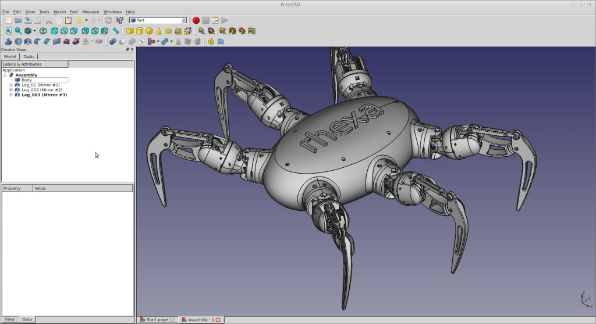

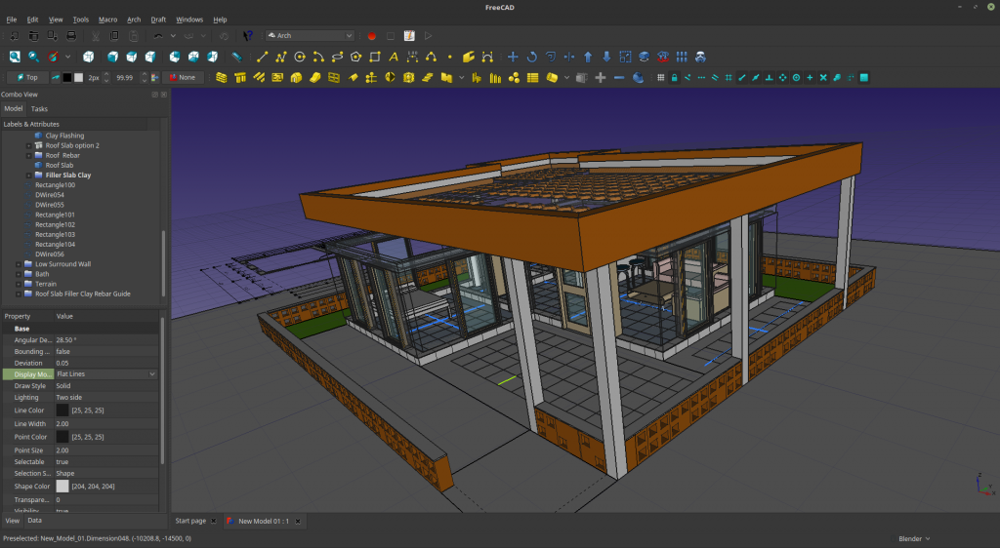

### Mayo

开源3D CAD查看器和转换器

https://github.com/fougue/mayo

###  QCAD

https://github.com/qcad/qcad

官网：https://www.qcad.org/en/

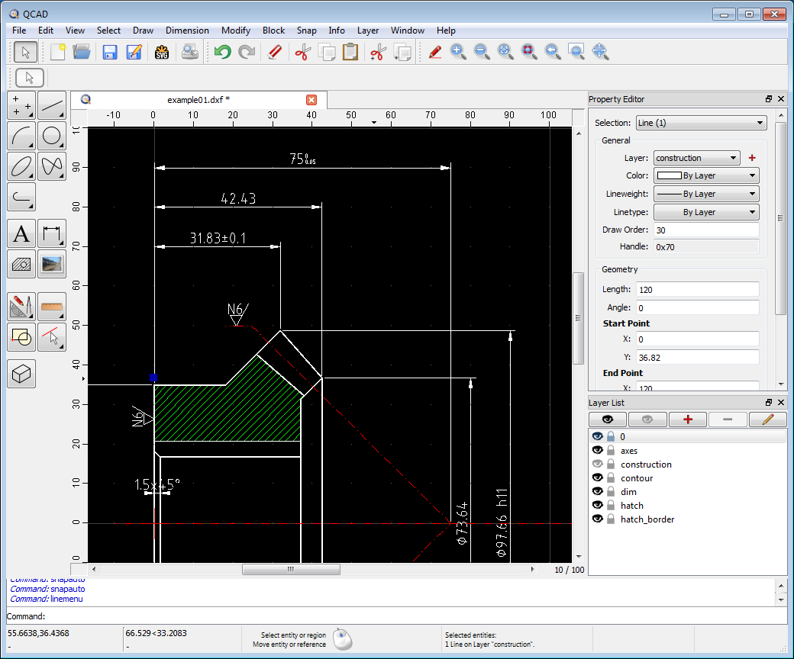

###  LibreCAD

https://github.com/LibreCAD/LibreCAD

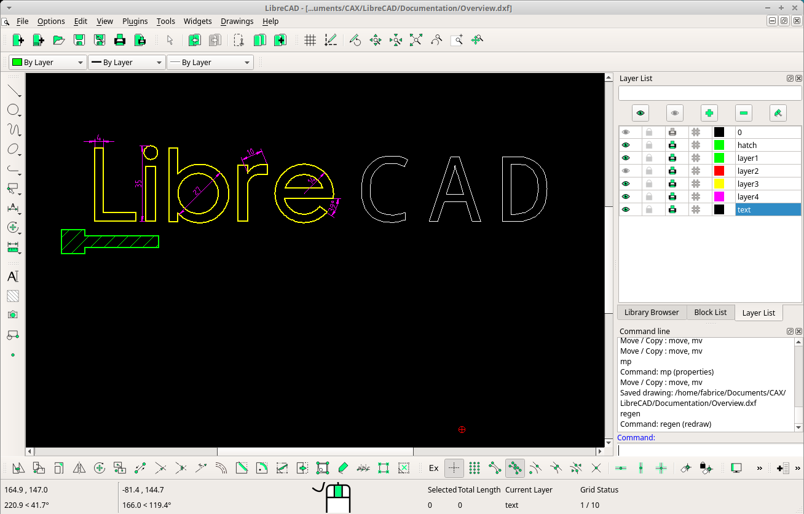

### rhiocad

CAD，基于OpenCascade。参数化，参数化三维建模器

https://github.com/mikowiec/rhioCAD

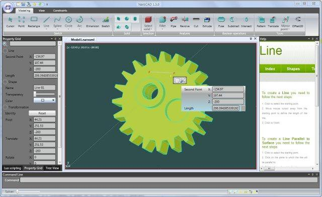

### Analysis Situs

Analysis Situs是一个开源原型工作台和一个开发CAD/CAM/CAE算法的SDK。其主要驱动思想是为CAD软件开发人员提供一个高度直观、可视化和可定制的孵化器，新的CAD算法由此诞生。工作台使用C++和Tcl作为主要编程语言。该应用程序包括分层组织的数据模型、基于VTK的3D查看器和脚本控制台。提供了一系列几何处理算法，从CAD特征识别到网格计算。

http://analysissitus.org/

https://gitlab.com/ssv/AnalysisSitus

### TiGL

https://github.com/DLR-SC/tigl

TiGL几何图形库可用于计算和处理CPACS文件中存储的飞机几何图形。TiGL提供了许多与几何体相关的功能，如

用于计算飞机表面上点的点检索函数

求交函数以计算飞机与平面的交点

导出标准CAD文件格式（STEP+IGES）或网格格式的函数，包括VTK、Collada和STL。

### Klampt

Klampt是Kris' Locomotion and Manipulation Planning Toolbox（运动和操纵规划工具箱）的简称。它是一个用于机器人建模、模拟、规划、优化和可视化的开源跨平台软件包。Klampt的目标是为学习机器人、分析机器人、开发算法和智能行为原型设计提供一种广泛可用的编程工具。它在机器人操纵和运动方面具有特殊的优势。

Klampt本身是使用C++和Python混合开发的，图形用户界面基于Qt，图形渲染基于OpenGL。Klampt支持Windows、MaxOS、Linux等操作系统。它提供了C++和Python两种API供开发人员使用。

https://github.com/krishauser/Klampt

## EDA

### Kicad

https://gitlab.com/kicad/code/kicad

官网：[www.kicad.org](https://www.kicad.org/)

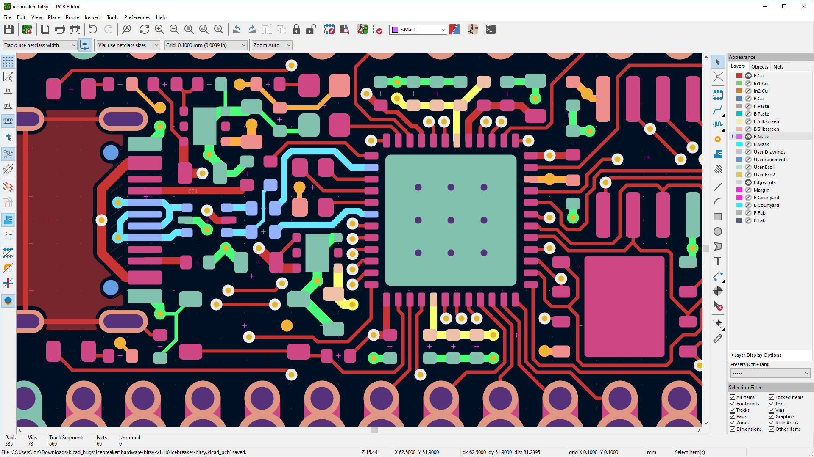

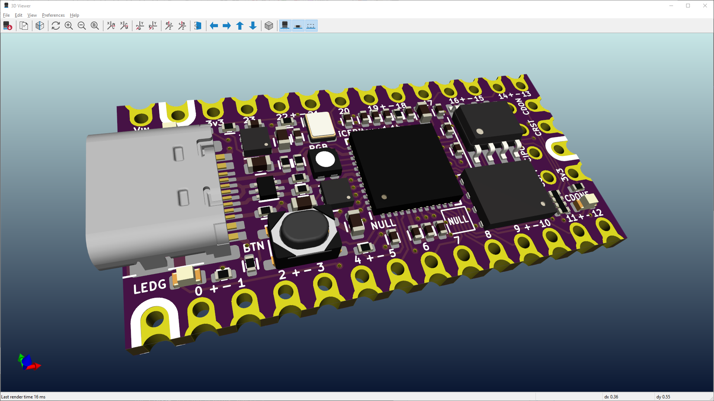

###  LibrePCB

https://github.com/LibrePCB/LibrePCB

LibrePCB是一个开发印刷电路板的免费EDA软件。它在Linux、Windows和Mac上运行。该项目仍处于相当早期的开发阶段。

## CAE方向

### OpenFOAM

OpenFOAM是由OpenFOAM基金会发布的免费开源计算流体动力学（CFD）软件包。它在工程和科学的大部分领域都拥有庞大的用户群，包括商业和学术组织。OpenFOAM具有广泛的功能，可以解决任何问题，从涉及化学反应、湍流和传热的复杂流体流动，到固体动力学和电磁学。

https://github.com/OpenFOAM/OpenFOAM-dev

### ParaView

ParaView是一个基于VTK的开源、多平台数据分析和可视化应用程序

https://github.com/Kitware/ParaView

官网：https://www.paraview.org/

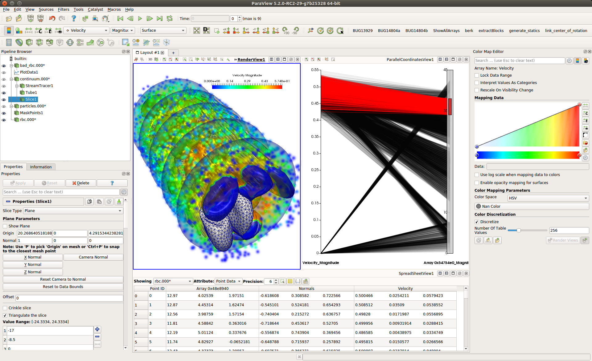

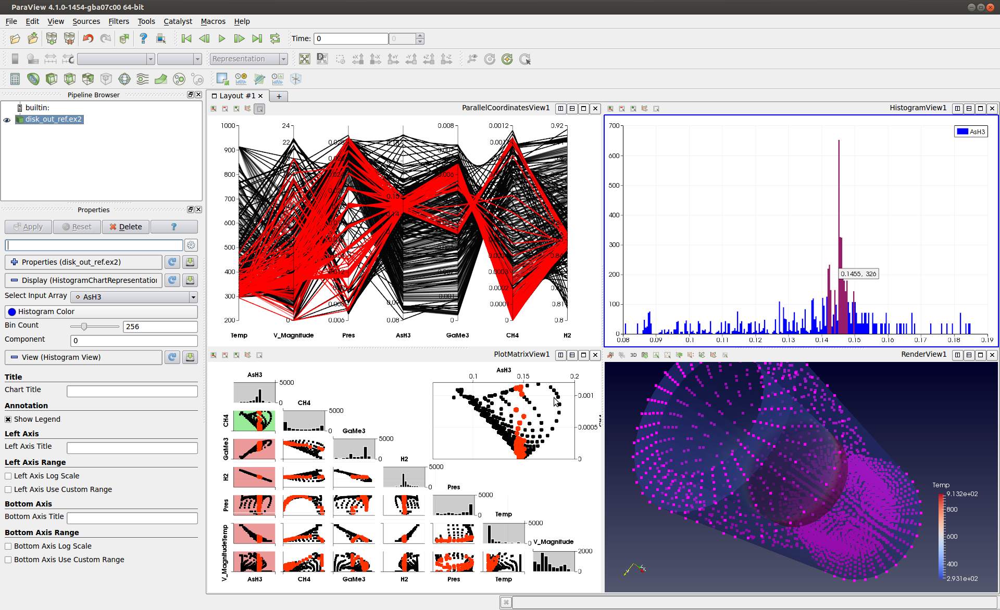

### FastCAE

专业的CAE前后处理集成系统——FastCAE

https://github.com/DISOGitHub/FastCAE

https://gitee.com/DISOGitee/FastCAE

官网：http://www.fastcae.com/

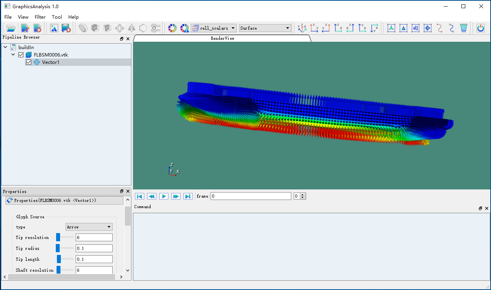

## FEM

### GMSH

Gmsh是一个开源的三维有限元网格生成器，具有内置的CAD引擎和后处理器。其设计目标是提供一种快速、轻便、用户友好的网格工具，具有参数化输入和高级可视化功能。Gmsh围绕四个模块构建：几何体、网格、解算器和后处理。

https://gitlab.onelab.info/gmsh/gmsh

官网：https://gmsh.info/

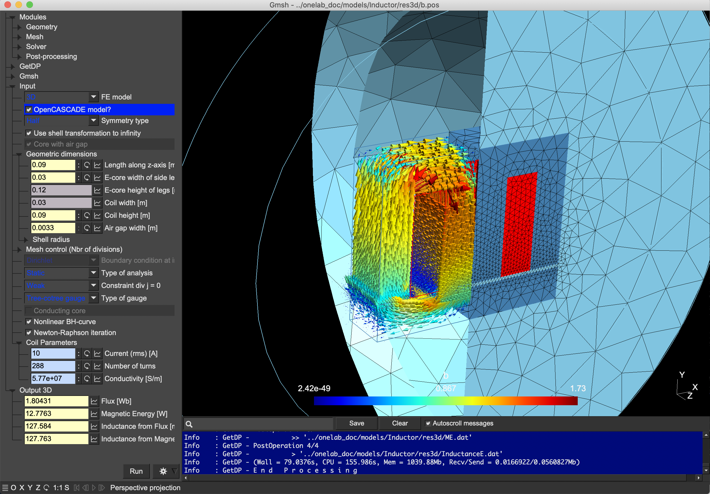

## 可视化

### OpenCASCADE(OCC)

https://dev.opencascade.org/

OCCT是唯一的开源全尺寸三维几何库。OCCT致力于成为最好的免费cad软件内核之一，广泛用于开发涉及以下工程和机械领域的专业程序：三维建模（cad）、制造（CAM）、数值模拟（CAE）、测量设备（CMM）和质量控制（CAQ）。自1999年作为开源CAD软件内核发布以来，OCCT已成功应用于从建筑施工到航空航天和汽车等众多项目。

### OpenNURBS 

https://github.com/OpenNURBS/OpenNURBS

openNURBS 旨在为CAD、CAM、CAE与计算机图形软件开发人员提供一个在不同的软件间精确转换 3D 几何的工具。

openNURBS 所提供的工具包括：

- 用于读写 3DM 文件的 C++ 源码库，支持微软与苹果公司的操作系统，提供一个 makefile 作为其他编译器的入口点。
- 可以读、写3DM文件格式的.NET 源代码库。
- 品质保证与版本控制。
- 技术支持。

### VTK

VTK是一个开源软件系统，用于图像处理、3D图形、体绘制和可视化。VTK包括许多高级算法（例如，曲面重建、隐式建模、抽取）和渲染技术（例如，硬件加速体绘制、LOD控制）。

https://github.com/Kitware/VTK

官网：https://vtk.org/

### CTK

CTK是一个社区努力为医学图像分析、手术导航和相关项目提供支持代码。里面有很多集成好的窗体可以使用

https://github.com/commontk/CTK

官网：http://commontk.org/

集成窗体预览：http://commontk.org/index.php/Documentation/ImageGallery

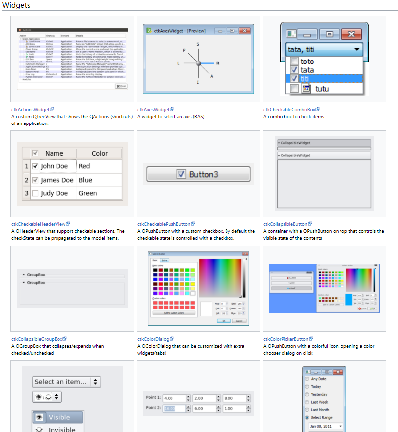

### ITK

ITK是一个开源的跨平台库，为开发人员提供了一套广泛的图像分析软件工具。ITK是通过极限编程方法开发的，它建立在一个成熟的、面向空间的体系结构之上，用于处理、分割和注册二维、三维或多维的科学图像

https://github.com/InsightSoftwareConsortium/ITK

官网：https://itk.org/

### 3D Slicer

解决高级图像计算挑战的桌面软件，专注于临床和生物医学应用。

https://github.com/Slicer/Slicer

官网：https://www.slicer.org/

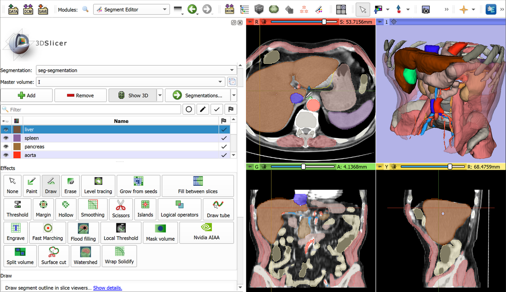

### LabPlot2

LabPlot是一个用于数据集和函数的二维和三维图形表示的程序。它带有一个完整的用户界面，它为您提供了很多功能，如希尔伯特变换、统计、颜色映射和条件格式

https://github.com/KDE/labplot

官网：https://labplot.kde.org/

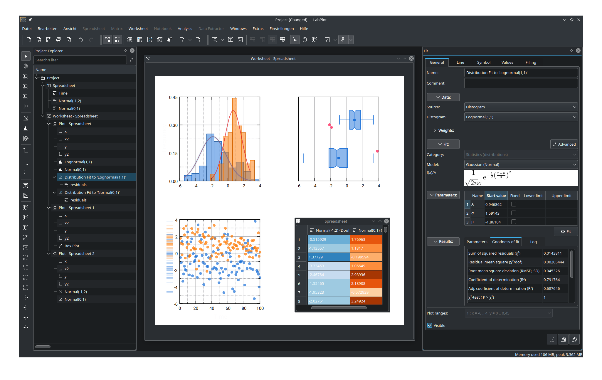

### inviwo

Inviwo是一个用于快速原型可视化的软件框架。它使用C++编写，充分利用现代图形硬件，并遵循BSD许可协议，允许在任何环境（包括商业环境）中自由使用。

https://github.com/inviwo/inviwo

### visit

VisIt是一个开源的、交互式的、可扩展的、可视化、动画和分析工具。

无论是Unix、Windows还是Mac工作站，用户都可以交互式地可视化并分析，从小型桌面电脑（<10核心）到规模大型计算机（>10,000核心）等各种规模的数据。

用户能够迅速生成可视化图像，通过时间进行动画展示，使用各种运算符和数学表达式来操作它们，并将生成的图像和动画保存用于演示。VisIt支持丰富的可视化功能，使用户能够查看包括在二维和三维（2D和3D）结构化、自适应和非结构化网格上定义的标量和矢量场在内的多种数据。由于其可定制的插件设计，VisIt能够可视化来自120多种不同科学数据格式的数据。

https://github.com/visit-dav/visit

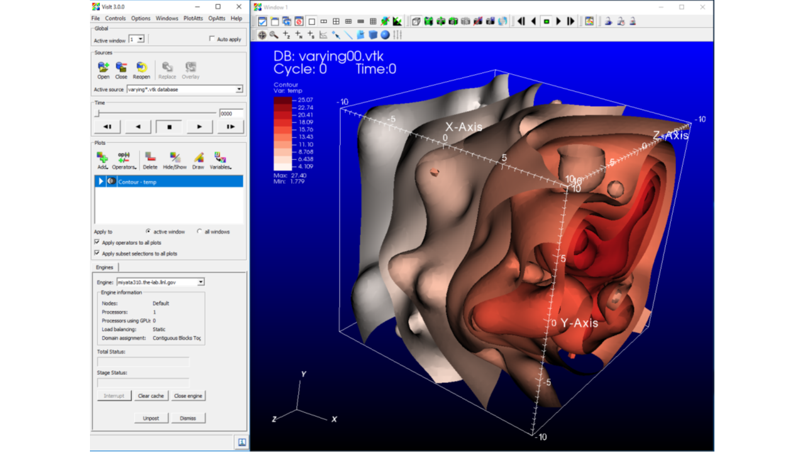

## 地理信息

### QGIS

QGIS是一个功能齐全、用户友好、免费开源（FOSS）地理信息系统（GIS），可运行在Unix平台、Windows和MacOS上。

https://github.com/qgis/QGIS

官网：https://www.qgis.org/

### GPXSee

GPXSee是一款基于Qt的强大的GPS日志文件查看器和分析工具，它支持几乎所有常见的GPS日志文件格式。无论你是户外爱好者、数据分析师，还是软件开发者，GPXSee都能提供直观且功能全面的界面来帮助你查看、解析和理解你的GPS轨迹数据。

https://github.com/tumic0/GPXSee

